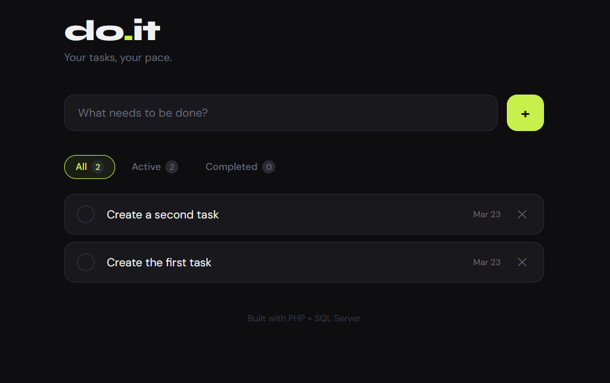
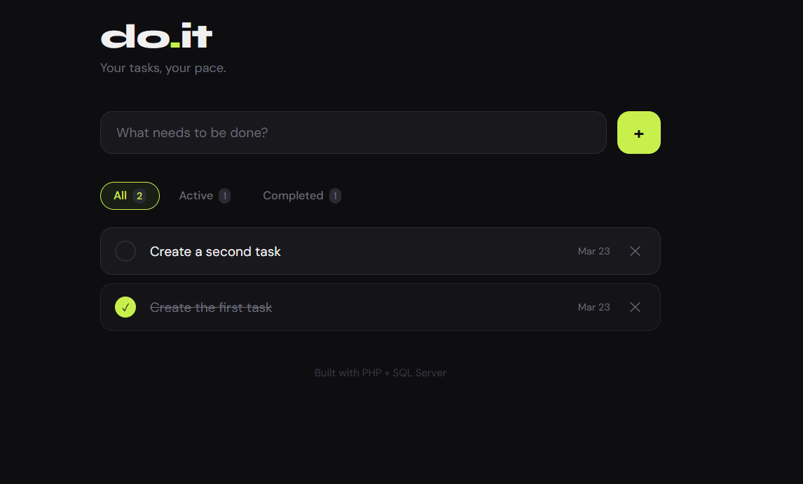

# php-todo-app

A todo list app built with PHP and SQL Server. My first PHP project.

## Features
- Add, complete and delete tasks
- Filter tasks by status

## Tech
- PHP 8.3
- SQL Server
- Laragon

## Setup
1. Create the database in SQL Server Management Studio
2. Copy the project to `C:\laragon\www\`
3. Open `http://localhost/todo-app-v2/` in your browser

## Files
- `index.php` - main page and all the PHP logic
- `style.css` - all the styling
- `config.php` - database connection

## Screenshots

